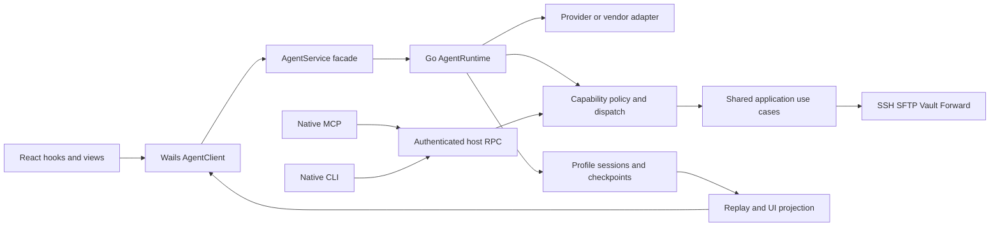

# AI 迁移技术设计与协议契约

设计日期：2026-09-14。状态：待实施设计；仅配套 [执行方案](ai-migration-execution-plan.md)，不改变 matrix、ledger、accepted decision 或 AI-last 门禁。下文“必须”表示实现达到本设计验收的条件，不表示现在已获生产代码开工许可。既有治理文件与本设计冲突时，以治理文件为准并修订设计。

## 1. 选型与版本：采用当前可靠方法，锁定可复现组合

### 1.1 本地查证与实施建议

| 项目 | 本次确认的事实 | 后续实施选择与验证 |
| --- | --- | --- |
| Go | 根 `go.mod` 为 `go 1.25.0`；本机 `go version` 实际为 `go1.25.0 windows/amd64` | 官方 release history 当前列 Go 1.27.1（2026-09-01）。以它作为工具链升级候选，先验证 Wails、CGO、平台 helper 与 race 支持，再锁 CI/本地工具链。`go` directive 与实际编译器分别记录；不要只改一行便声称升级完成。来源：[Go release history](https://go.dev/doc/devel/release) |
| Wails | 设计时根模块为 `v3.0.0-alpha.63`、npm runtime 和生成命令为 `3.0.0-beta.12`；该漂移已于 2026-09-14 按 WV3-L133 对齐到 `v3.0.0-beta.12`（go module、npm runtime、generator 三处一致，bindings 重生成零 diff），`npm run check:wails-versions` 在 CI 防回归。后续升级仍须先评估再锁同一已验证发行组合；记录 Go module、npm lock、generator 三者实际版本和来源，重新生成 bindings 并做三平台桥接 smoke。API 以锁定版本源码为准。来源：[Wails bridge](https://v3.wails.io/concepts/bridge/) |
| MCP | 旧 Electron 使用 Node MCP server | 首选官方 `github.com/modelcontextprotocol/go-sdk/mcp`。其兼容表列 v1.7.0+ 支持 2026-07-28 及多版旧协议；开工时锁一个经验证的具体 tag/sum，不使用浮动 `@latest`。Netcatty 只写 catalog、principal、dispatch adapter。来源：[官方 Go SDK](https://github.com/modelcontextprotocol/go-sdk) |
| OpenAI-compatible | 旧配置支持 Chat 和显式选择的 Responses | 官方端点首选官方 Go client；自建兼容端点通过同一项目 adapter 接入，SDK 缺字段时仅补协议转换层。OpenAI 官方文档当前示例为 `github.com/openai/openai-go/v3`，不能把所有兼容端点强改 Responses。来源：[OpenAI SDKs](https://developers.openai.com/api/docs/libraries) |
| Anthropic | 旧 Catty 使用 Vercel provider | 首选官方 Go Messages SDK，保留 Netcatty context、policy、tool loop；不把 Claude Code runtime 当作 Messages client。来源：[Claude 官方 SDK](https://platform.claude.com/docs/en/cli-sdks-libraries/overview) |
| Google | 旧 ProviderStyle 为 `google`，需要原消息 parts/函数调用语义 | 首选官方 `google.golang.org/genai`；按原配置的 API 家族做 parity。新 API 家族另建适配与迁移测试，不能借升级 SDK 偷换用户端点或会话协议。来源：[Gemini libraries](https://ai.google.dev/gemini-api/docs/libraries) |
| 并发测试 | 当前 Go 已达到 1.25 | 使用 `testing/synctest.Test/Wait` 验证纯 Go 状态机、deadline 和竞态；网络/真实进程测试用可控 fake 或独立集成测试。该包从 Go 1.25 已正式提供，不使用旧的 GOEXPERIMENT API。来源：[Go 1.25 release notes](https://go.dev/doc/go1.25) |

工具链/Wails 对齐属于基础 shell 资格验证：应在取得有效 NONAI-COMPLETE 前完成；若在 gate 后改动已验证基础依赖，按既有 gate epoch 规则补证/重开，不把它夹带在 Provider PR 中。`scripts/wails-build.mjs` 当前仅构建 Windows GUI；macOS/Linux 使用对应已资格验证的构建入口。

不引入通用多 Agent 框架、向量数据库、远程队列或另一套持久层作为本次迁移前提。当前最短实施路径是复用 Go Profile Store/bbolt、现有 SSH/SFTP 服务、React 视图和官方协议客户端，移植项目已经存在的 AgentRuntime 行为。未来确需新依赖时，用实际缺口、维护状态、平台支持、license、体积与测试证明收益。

### 1.2 每次切片的版本证据

在切片 evidence 中记录以下内容；这是实施时生成的记录格式，当前不生成虚构 hash：

```json
{
  "checkedAt": "<UTC time>",
  "repositoryCommit": "<commit plus relevant dirty-file hashes>",
  "goCompiler": "<go version>",
  "wailsGoModule": "<tag and sum>",
  "wailsNpmRuntime": "<resolved version and lock integrity>",
  "wailsGenerator": "<exact version>",
  "protocols": [
    {"adapter": "<id>", "sdk": "<module@tag>", "wireVersions": [],
     "schemaSHA256": "<digest>", "sourceURL": "<official page>"}
  ],
  "vendorBinary": {"path": "<redacted>", "version": "<version>",
                   "sha256": "<digest>", "runtimeDecision": "<accepted decision>"}
}
```

最新文档回答“现在推荐什么”；锁定源码与 fixture 回答“这个构建究竟支持什么”。两者不一致时先做协议探针，不能由文档推断已装 binary 的权限/恢复能力。SDK 升级、schema 升级、行为改变分别可审查；本轮只更新设计。

## 2. 包结构、依赖方向与完整功能覆盖

建议新增结构如下；目录不存在时不要把它当作可运行的命令目标：

```text
internal/app/                    shared terminal/vault/SFTP/forward use cases
internal/app/contracts/         shell-neutral wire DTO + TS code generation
internal/capability/             catalog metadata, policy, dispatch registry
internal/rpc/                    authenticated local host RPC
internal/agent/
  runtime/                      turn coordinator, interaction router, cancellation
  events/                       event envelope, reducer, bounded replay
  sessions/                     history, runtime identity, durable checkpoints
  providers/                    OpenAI, Anthropic, Google thin adapters
  context/                      budget, pruning, compaction, continuation
  tools/                        output handles, dedup, tool scheduler
  process/                      native subprocess lifecycle and provenance
  adapters/                     external vendor protocol adapters
cmd/netcatty/                   Wails facade + composition root
cmd/netcatty-mcp/               official MCP SDK + Netcatty adapter
cmd/netcatty-tool/              native first-party CLI
```

依赖约束：wire DTO 放 `internal/app/contracts`，只依赖基础类型，不能反向 import runtime 或 Wails。`internal/agent`/`internal/capability` 可使用 contracts 与共享 use case；`cmd/netcatty` 注入实际服务；只有桌面 shell 引入 Wails。这些子目录只有在职责确实独立时建立，禁止为每个接口再造 factory/manager/repository 层。



### 2.1 先声明完整 catalog，再逐批接真实 handler

冻结 `testdata/migration/electron/capability-catalog.json` 当前有 77 个条目，基线 status 均为 `implemented`：attachment 2、harness 6、meta 1、portforward 8、session 5、sftp 11、terminal 4、vault 40。这个数是基线目录条目数，**不是每个 Agent 都可见 77 个工具，也不是当前 Go 已实现 77 个**。

目录 metadata、handler availability、migration matrix status 是三个概念。初始 Go 可声明全部 metadata，但只把依赖已就绪的 handler 暴露给当前 surface；缺 handler 必须出现在 parity 报告。`harness.*` 等 Go Runtime 就绪后注入。最小链路阶段可以只启用一个读工具做内部验证；不能在功能未接齐时发布替代旧版本或宣布 AI-01 完成。

policy/dispatch 先定义 shell-neutral ApprovalPort，由 composition root 注入后续 InteractionRouter；runtime 不反向持有第二份 policy。RPC/CLI 早期测试可注入受控 approval fake，但未接真实交互的 Confirm 写路径不能对用户开放，也不能将其计为已完成。这样不必为了启动 MCP/CLI 提前复制一套 renderer 审批。

每行覆盖记录至少包含：stable ID、旧 schema/policy/surface/kind、原 handler、共享 Go 方法、新增语义、state owner、fixture、正例/拒绝例、是否已暴露、retirement 条件。特别保留 `bypassesApproval`、`bypassesChatCancel`、`bypassesObserverBlock`、`requiresChatSession`、`sensitiveRead`；不能用单个 `write` boolean 重建全部旧策略。

### 2.2 不能被“9 个 turn 方法”遗漏的旧 AgentPort

逐项审计 `infrastructure/runtime/generated/runtimePorts.ts` 的完整 AgentPort 和所有调用点。原协议的 generated 文件不可手改；兼容层变更要同步其生成输入。

| 旧方法族/调用方 | 目标 seam | 必须保留或显式处置的行为 |
| --- | --- | --- |
| `aiChatStream/Cancel`、`aiSdkAgentStream/Cancel/Steer`、流事件 | 单一 AgentClient + AgentService turn 方法 | UI 展示、历史恢复、Stop、steer 的实际支持差异 |
| `aiExec`、`aiCattyCancelExec`、MCP sessions/grants/tool mode | host use case + Go policy | job owner、terminal queue、scope、退出清理 |
| `aiFetch`、`aiSyncProviders`、model discovery | typed provider/config 方法 | 自定义端点/headers/代理/TLS、缓存 revision，逐个迁走裸 fetch |
| Codex login/status/logout/account、discover/integration | 通用 runtime inspection + 有类型的账户操作 | 认证流程取消、账户切换后 resume 失效、不可用原因 |
| SDK plugin/marketplace/MCP status 方法 | 有类型的 adapter administration | 独立于 Netcatty 插件 host；无法满足 runtime/policy 约束时必须有对应 decision，不能静默丢方法 |
| `aiUserSkills*` | Go skills/config use case | 文件路径/作用域、上下文构造与设置入口；不让 renderer 直接读任意路径 |
| `externalMcp*` | Go external integration service | 启停/模式/状态、单独 token、配置合并、幂等更新与撤销 |
| Codex interaction、elicitation、Vault request/response | InteractionRouter + shared Vault use case | 不再由 UI 持有解密权限或原始 vendor request；pending UI 可以恢复 |

允许按职责增加配置/账户 facade，但不为每个 vendor 建一套 turn 生命周期。生成 Client contract 后先保留薄 compatibility mapper，迁完调用点并用 import 检查证据证明无人使用，再删除 mapper。

## 3. Wire DTO、错误与调用语义

以下是需落成 Go struct 并由现有 contract generator 生成 TS 的形状，不是直接复制到 React 的第二份手写类型。统一复用现有 request ID/error 基础类型；若基础 ErrorCode 没有 AI 所需代码，通过 registry 扩展，不返回各模块私有错误字符串。

| 类型 | 必需字段与语义 |
| --- | --- |
| `PrepareTurnRequest` | `requestId`（幂等键）、`chatSessionId`、`expectedChatRevision`、`agentId`、`providerConfigId?`、`modelId?`、`input{text,attachmentIds}`、`requestedScope`；scope 是请求，host 必须校验收窄 |
| `PreparedTurn` | `turnId`、`leaseExpiresAtMs`、`cursor`、`snapshotRevision`、`effectiveScope`、`effectiveConfigRevision`、`policyRevision`；不得包含密钥或凭证正文 |
| `TurnCommand` | `requestId`、`turnId`；Start 使用 prepare token/owner 校验；Stop 加 reason；Steer 加 input 与 expected turn revision |
| `AgentEventEnvelope` | `schemaVersion:1`、`instanceId`、`chatSessionId`、`turnId`、`sequence`、`type`、`backend`、`timestamp`、有类型的 `payload`；相关事件带 `messageId/modelCallId/toolCallId`，区分一 turn 内的多个 message/step |
| `ReadEventsRequest` | `turnId`、`afterSequence`、`limit`；turn ownership 从 host principal 校验，不能靠知道 ID 读取 |
| `EventPage` | `events`、`nextCursor`、`hasMore`、`cursorExpired`、`snapshot?`；snapshot 有自己的 `throughSequence`，该序列之前的事件不能再次应用 |
| `TurnSnapshot` | `status`、`revision`、`throughSequence`、该 turn 的有序 message projections、pending interactions、active owned jobs、terminal reason、usage completeness；opaque continuation 不发给 UI |
| `InteractionRequest` | `interactionId`、`revision`、`turnId`、`kind`、`createdAtMs`、`deadlineMs`、脱敏 `subject`、decision options/input schema、`policyRevision`；原始请求与参数 hash 只在 Go |
| `ResolveInteractionRequest` | `requestId`、`interactionId`、`expectedRevision`、`decision` 或有类型 answers；不接受 renderer 重新提交待执行命令/路径 |
| `RuntimeInspection` | adapter/protocol/version、capabilities、provenance 状态、runtime decision、可恢复性和 typed unavailable reason；不返回环境 secret |

`sequence`、`revision`、持久 token 大计数使用十进制字符串；毫秒时间戳保持现有 number 兼容。原有非 AI Profile number revision 本轮不做全局破坏式改动，但新增 AI bridge 必须做无损转换。ID 由 Go 使用既有 `internal/app` 随机 ID helper 的模式生成，不接受时间戳计数器充当授权凭证。JSON object 的动态 keys 过滤原有不安全键；任意 vendor payload 不得反序列化为可执行类型。

错误建议：复用 `invalid-request/conflict/cancelled/deadline-exceeded/unavailable` 等基础码，扩展结构化 reason 如 `busy`、`stale-revision`、`stale-session`、`unsupported`、`scope-denied`、`approval-expired`、`cursor-expired`、`protocol-error`、`outcome-unknown`、`storage-unavailable`。客户端根据 code/reason 分支，不解析人类错误文字。错误可附 trace ID、retry advice、受限 details；不得附原始 credential、完整 HTTP header 或未脱敏 stderr。

### 3.1 幂等规则

幂等记录键为 `(profile, principal, operation, requestId)`，保存 canonical 参数摘要及最终响应。同键同参数返回同结果，同键不同参数返回 conflict。Prepare 重试返回相同 turn；Start 重试不追加第二条用户消息、不二次启动模型；Resolve 重试不二次执行工具；Delete 重试不恢复已删除数据。

幂等记录至少覆盖 pending 和该 turn 的恢复周期；完成记录在规定 retention 内保留。过期/跨 epoch 的 mutating request 明确拒绝并要求读取现状，不能把无法判断是否执行过的写操作当新请求自动重做。真正可重复执行的读操作另按目录策略处理。网络“恰好一次”不可保证；本设计保证本地逻辑状态转移幂等，并显式处理外部副作用结果未知。

## 4. 生命周期、恢复与 UI 事件

### 4.1 状态机

| 当前状态 | 输入 | 转移与必须完成的动作 |
| --- | --- | --- |
| 无活跃 turn | Prepare | 验证账户/配置/scope/chat revision；生成 prepared reservation 和 lease；不调用 Provider、不写历史用户消息 |
| prepared | Start | 原子验证 lease/config/policy、保存输入和 running checkpoint、占用活跃 turn；一次发布 turn_start 后调用 driver |
| prepared | lease 过期或 Stop | 释放 reservation；返回 expired/cancelled prepared 状态，不伪造运行过的 turn_start/turn_end |
| running | 需要审批/用户输入 | 保存 pending interaction，转 waiting；释放锁；driver 等待 host 结果 |
| waiting | 有效回答 | 原子消费 interaction；重新验证 scope/policy/参数/取消状态；转 running；至多 dispatch 一次 |
| running/waiting | Stop、永久窗口关闭策略、App Lock、应用退出 | 转 stopping；拒绝新写、拒绝 pending interaction、取消该 turn 子 context；异步清理拥有的资源 |
| running | driver 明确完成/不可恢复失败 | 由 coordinator 进入唯一 finalize 流程 |
| stopping | driver 结束或强制回收完成 | finalize cancelled；远程执行结果未知时另存 outcome-unknown，不能标成远程执行成功停止 |
| 任意未终结持久 turn | host 重启 | 标记 interrupted/host-restarted，恢复可读 checkpoint，封闭 pending interaction；不自动重放 tool 或付费模型调用 |
| completed/cancelled/failed/interrupted | Stop/重复最终通知 | 返回已有终态；不产生第二个 terminal event |

internal status 可细分，投影到既有 `AgentEvent` 的 turn_end 为 `completed/aborted/error`，并保留有类型 reason；UI 新字段要兼容旧历史。`external-sdk` 是既有展示/持久化 backend 值，可在兼容 mapper 保留，不能因迁移 Go 就使旧历史无法解析。

turn context 来自应用/service 生命周期，再加独立 CancelCause；一次 Wails 调用结束、React effect cleanup 或 WebView reload 不能默认终结 turn。Wails 官方提供应用/service 启停生命周期；具体 hook 和取消语义需在锁定版本 smoke 验证。来源：[Wails lifecycle](https://v3.wails.io/concepts/lifecycle/)。

### 4.2 唯一 writer 与持久 checkpoint

每个 chat coordinator 串行提交状态，外部 I/O 在锁外执行，回调以 turn/epoch 校验后进入 reducer。Go runtime 是 AI 消息/usage/pending 状态唯一持久 writer；React reducer 只投影。

不要求每个 token 都写磁盘。至少在 Start、交互产生/消费、tool 准备执行/得到结果、context compaction、finalize 时保存 checkpoint；长流按有界批次保存可读进度。复用现有 bbolt 事务，在同一事务中提交 terminal state、该 turn 的最终 message projections、usage ledger、final sequence/terminal record，然后发布通知。checkpoint 要保存必要 continuation，UI 投影要删掉 opaque provider 私有信息。

崩溃可能丢失上次 checkpoint 后的展示 token，恢复页必须显示 interrupted，不能伪装完整成功。若终态已提交但通知丢失，ReadEvents/snapshot 能恢复；若磁盘提交失败，不发布“已持久完成”，报告 storage-unavailable，停止接受新的副作用操作并保留可导出的脱敏内存快照。不能为“确保成功”偷偷切回 localStorage 第二 writer。

tool receipt 状态建议 `planned -> dispatching -> succeeded/failed/unknown`。dispatching checkpoint 在调用外部副作用前提交；崩溃后处于 dispatching 且没有可靠远端 receipt 的操作标 unknown。SSH/SFTP/供应商调用通常无法和本地事务原子提交，因此禁止自动重做 unknown 写操作。

### 4.3 事件读取算法

1. UI 安装 listener；Prepare/Start 后主动 ReadEvents，不依赖第一条通知一定到达。
2. Wails 通知只带 turn ID 与最新 cursor，Go 保留有界 event ring。客户端最多一个 read loop；读取 `hasMore` 直到追平。
3. reducer 去掉已应用的 sequence；发现缺口先补读。snapshot 和 `throughSequence` 作为一个原子投影替换，之后只应用更大的序列。
4. 活跃 turn 增加低频 reconciliation（建议初始 2 秒，可见窗口才轮询；窗口恢复焦点即补读），处理“最后一条通知也丢失”。具体间隔用 smoke/性能证据调优。
5. ring 淘汰返回 snapshot；终态只存持久 terminal record/checkpoint，不无限保存 delta。旧 turn 的历史查询不依赖内存 ring。
6. App restart 的 instanceId 改变，UI 清掉旧未确认队列并获取 authoritative chat snapshot；不能拿上个进程 cursor 与新事件拼接。

跨 chat 没有全局事件顺序承诺。原始 PTY 流继续用终端 dataplane。用同一 turn 的 sequence 确保审批、tool、usage 与文本投影可确定排序；model delta 可以批量输送，但不能越过 interaction/terminal/control 事件。

### 4.4 Stop 与共享资源

Stop 返回 accepted 只表示取消请求已提交，UI 保持“正在停止”直至 terminal snapshot/event。保留一个统一 stop owner，不让 UI、MCP、vendor adapter 各自产生 turn_end。

取消树按 turn 持有：provider HTTP body、tool context、该 turn 启动的 exec/job/transfer、interaction、临时附件 lease、vendor turn。共享 SSH pool、另一个 chat 的 job、已完成 turn 的 chat 级 output handle 不属于随手关闭对象。detach background job 只在已有 catalog 行为明确允许、owner 转移有 receipt 时成立。

vendor 先协议 cancel，超过已锁定 grace 再 process group/Job Object 回收。杀客户端不能证明远程 SSH 进程已结束；远端无法确认时保留 job/status 证据并显示 outcome-unknown，禁止自动重试写命令。进程树回收是资源管理，不是阻止 vendor 绕过 policy 的安全沙箱。

## 5. Catty Provider 与上下文实现

### 5.1 Provider 是协议 adapter，Runtime 才执行工具

最小内部 interface 语义：`Stream(ctx, ModelRequest, emit ProviderEvent) -> ModelOutcome`；`DiscoverModels(ctx, ConfigRef)`；`ClassifyError(err)`；`Capabilities(config, model)`。adapter 不读 React state、不自行执行 capability、不创建第二 turn loop。request 里的 secrets 由 request-local credential lease 注入；共享 HTTP Transport 来自 netpolicy；不得让官方 SDK 使用另一套默认代理/TLS。

| 协议 | 正确解析边界 | 最小 fake stream 验证 |
| --- | --- | --- |
| OpenAI Chat | role/content/reasoning/tool-call index 与 ID 片段，最终 finish reason、usage；保留显式 Chat 配置 | 多 tool 参数交错、空内容 tool-only、尾部 usage、兼容端点遗漏可选字段 |
| OpenAI Responses | 按 typed semantic event 解析 response/item/content/call IDs；completed/failed/incomplete 明确区分，不能把 output_text 完成当整轮完成 | 文本+函数调用、多 item、error、incomplete、流断裂；参考 [OpenAI streaming](https://developers.openai.com/api/docs/guides/streaming-responses) |
| Anthropic Messages | content block index 分组、partial_json 累积、signature 原样保留；usage 按累积语义归一；message_stop 才是该模型响应结束 | thinking/signature/text/tool_use 混合、message_delta usage、ping/未知事件；参考 [Anthropic streaming](https://platform.claude.com/docs/en/build-with-claude/streaming) |
| Google | candidate/part 顺序、function call ID、thought signature 与原 Part 绑定；按所选 API 家族转换 | 同响应多函数、签名 Part 不可合并、流末 usage、无正文只有函数；参考 [Gemini function calling](https://ai.google.dev/gemini-api/docs/function-calling) |

SSE/parser 处理 UTF-8 字符跨 TCP chunk、CRLF、多行 data、空心跳、最后无换行、截断、超大 frame、重复通知、未知可选事件。不能用 Go Scanner 默认上限处理任意长模型事件；设显式上限和 typed oversized 错误。只有参数完整、JSON 解析及工具 schema 校验成功、policy 通过后才 dispatch。

SDK 自带 retry 需统一配置，避免 SDK × runtime × transport 乘法重试。建议 runtime 持有 retry policy：未收到语义输出且无 tool progress 的可重试网络/429/5xx，遵循 Retry-After、总预算和有界退避；已有输出后的未知断连默认结束为 interrupted，不拼接两次生成。413 走专门 compaction 分支，不走普通 backoff；401/403 不自动重试。重试绝不重放已完成/未知结果的写工具。

### 5.2 Provider continuation 的无损迁移

旧 `infrastructure/ai/providerContinuation.ts` 已包含 source、reasoningParts、textProviderOptions、toolCallProviderOptionsById、openAIChatAssistantFields。不能仅迁 `content/thinking`，否则下一轮可能丢签名、调用 ID 或兼容字段。

设计 host 内部 `ContinuationRecord`：`schemaVersion`、provider config ID/type、API family、model ID、endpoint identity、credential profile revision、原顺序 parts/raw provider fields、关联 tool IDs、checksum。opaque 字符串/签名字节保持原值，JSON 只做无损安全解码，不能摘要、翻译、重新排序 parts 或把 thinking 文本当签名。换 provider/model/API family/auth boundary 时先验证 compatibility；不兼容则清理不可复用私有 continuation，用普通安全历史构造新请求并明确显示恢复方式。

完整 continuation 只在 Go 持久层与对应 Provider 间流动。迁移旧 ChatMessage 读入后分离 UI projection 和 provider-private record，保留备份用于回滚。新旧 traces 比对以消息/工具语义为准；真实模型 token 不做字节级相等要求。

### 5.3 Context budget 与超时先保持语义

依据旧 `contextBudget.ts`，首轮 Go parity 保留下列公式（token 单位）：

```text
outputReserve = min(configuredOutput or 4096, max(256, floor(window * 0.25)))
remaining = max(0, window - outputReserve)
buffer = min(max(outputReserve, ceil(remaining * (1 - 0.8))), 15000)
compactionThreshold = max(1, window - outputReserve - buffer - 150)
summaryMaxOutput = 1600
```

上述 outputReserve 公式用于正数 context window；旧 helper 对 window <= 0 直接返回配置输出值，需单独做 fixture，不应用正数分支。预估输入必须覆盖 messages/system/tools/attachments reserve；旧 estimator 的近似不能伪称准确 token。迁移 parity 完成后，可通过模型 tokenizer 或完整 tool schema 估算改进，记录 before/after 和阈值回归。真实 Provider usage 用于校准，不反向篡改历史记录。

| 阶段 | 必须保持的行为 |
| --- | --- |
| prepareTurnContext | 超预算时做 pre-turn compaction；保留当前目标、未完成工作、权限边界与 session 状态 |
| prepareStepContext | 只做 typed pruning/输出 handle notices，不产生新的 LLM summarize 调用 |
| HTTP 413 | 当前 `cattyTurnDriver.ts` 为至多一次强制压缩后重试：无 tool progress 时清理同一 assistant 草稿；已有 tool progress 时从最新历史构造请求、保留工具结果和写 fingerprint，创建新的 assistant segment；第二次失败不再进同一个 retry。Go 一个 turn 可含多个 assistant segments，不能压成一个 message 而丢历史 |
| compact/replay | 不能移除未闭合 tool call 的唯一结果；摘要视为上下文数据，不可升级为系统授权；保留附件/输出句柄可用性提示 |

旧 write replay 去重的目的，是为已确认执行过且 fingerprint 匹配的请求保留结果，不是授权再次执行。Go receipt 必须区分 succeeded 与 unknown：前者可按相同调用身份复用结果，后者不能伪造成功或重跑。此规则与 Provider 普通网络重试共用一套 side-effect 账本。

以 `streamTimeouts.ts`、`shared/approvalConstants.ts` 为基准逐参数测试：response idle 默认 120 秒、step 下限 10 分钟、total 下限 30 分钟、compaction 90 秒；confirm 预算包含审批。Catty 审批 idle/hard 与外部 MCP/vendor deadline 不相同，不能统一硬编码成 30 秒。有效 deadline 取各层剩余预算最小值；当前 TS 超大 total 可能为 undefined，Go 要显式建模“无该层 deadline”，不能转换成零时长立即取消。业务调整单独批准并补 fixture。

### 5.4 Usage 与活动记录

`step_end` usage 和整轮 `usage` 是不同粒度。记录 vendor/source、modelCallId、turnId、计数类型（delta/cumulative/final）、输入/输出/cache/reasoning tokens、是否完整；用稳定事件 ID/序列防重。不能把每步之和再加 turn total。Provider 没返回 usage 时保存 unknown/partial，不填 0 伪装真实计量；外部 agent 的 thread 累积量须按协议取 turn 增量。

`model_delta`、`reasoning_delta`、file_change、web_search、plan_update、recoverable warning、performance、compaction trace 继续投影为原 ChatMessage/AgentActivity 视图。新事件可带版本化字段；未知可选活动不能导致历史页整体失败。活动记录中的路径/命令按既有脱敏策略处理，不保存密钥。

## 6. 工具、输出与权限

### 6.1 单一路径与审批快照

dispatch 顺序：认证 principal -> 验证 capability/surface/kind -> 参数 schema -> 解析 resource scope -> 读取当前 policy/grants -> 必要 interaction -> 复核 scope/revision/cancel -> 执行同一共享 use case -> 脱敏/限流输出。

审批绑定 canonical capability ID、规范化参数 hash、profile/chat/terminal/workspace、policy revision、期限。批准 A 路径不能替换为 B；权限变更使尚未执行的旧批准失效。批准只消费一次；Stop 与批准同时发生时，以 Go coordinator/dispatch gate 的原子顺序为准，不能在取消以后再启动写入。

Observer 拒绝写；Confirm 经有效 grant 或用户决定；Auto 仍受 resource scope、host secret 禁读、已取消状态及固定禁用能力约束。命令 blocklist 是额外规则，shell 字符串分类不能证明任意命令只读。敏感读取和 control exception 按 catalog 明确字段测试。vendor 原生 session grant 只在 vendor session 内有效，不写入永久 Netcatty permission grants。

不要混淆三类数据：Netcatty 持久 Agent grant、vendor session-only grant、Netcatty 插件 permission grant。插件 principal 与 Agent principal 不可互换。

### 6.2 Terminal exec 不能等同于 Write

`TerminalService.Write` 只是向 PTY 写字节，不能证明命令完成、退出码、取消结果或当前 cwd。需要从旧 `mcpServerBridge`、exec/session queue tests 提取执行契约，复用已有 SSH/PTY/monitoring 底层：选择有明确 exec channel 的远端执行，或实现旧交互 PTY marker/归属协议。交互 shell 与非交互 exec 的 cwd/env/profile 差异必须作为测试输入，不能悄悄换语义。

一个 terminal 的有副作用操作跨 chat 串行；不同终端可有界并行。Stop/control 不排在普通执行队列尾端。无退出状态时返回 running/unknown，禁止虚构 exitCode 0。后台 job 保存 owner、command digest、startedAt/deadline、status、output handle、实际取消能力；poll/stop 查 owner 并按策略响应。

### 6.3 输出 handle 的兼容与资源预算

旧 `toolOutputStore.ts` 的上限/单位必须先冻结：

| 项目 | 旧基线 |
| --- | --- |
| 单次读取 | 12,000 个 JS 字符单位 |
| 单 handle | 4,000,000 个 JS 字符单位 |
| 单 chat | 64 handles / 8,000,000 个 JS 字符单位 |
| 全局 | 256 handles / 32,000,000 个 JS 字符单位 |
| TTL | 30 分钟，以 accessedAt 驱动过期与 LRU |
| spill threshold | 0；配置了 persistence 时所有达到该阈值的 handle 都尝试异步 spill，失败时旧实现保留有界内存副本；没有 persistence 时不 spill |

JS 字符索引是 UTF-16 code unit，Go `len(string)` 是字节，rune 又是另一种单位。兼容 `offset/maxChars/search` 时定义明确单位，对中文/emoji/组合字符/代理对边界做 golden；若改用 UTF-8 byte offset，必须升 schema/version 并提供旧 handle 适配，不能静默更换。

handle 为不可预测 ID，保存 profile/chat/terminal/turn scope、MIME/encoding、尺寸、hash、创建/访问时间、删除 tombstone。读之前验 owner 和 scope，不能把存在性作为授权；chat 删除/terminal 关闭按原规则失效，跨 turn 保留到 TTL。ToolResultDedup 按 turn 新建，不能把上个 turn 的普通读去重错误地延续到新 turn；已持久 tool receipt 的恢复防重是另一层语义。spill 只进入 Netcatty 专用 temp manager，以受限路径/权限写入并清理，不能直接 `os.TempDir()`。expired/not-found 返回明确结果，不拿截断内容伪装完整结果。

新增 event ring/frame 上限独立用字节计，避免大 Unicode 输出突破内存预算。初始调优候选：每 turn ring 8 MiB、全局 64 MiB、ReadEvents 每页最多 128 条且 256 KiB；单条过大转 snapshot/handle，不无限增大 page。prepared lease 初始 30 秒。以上为工程候选值，必须压测后锁入配置与 contract；不是已验收的性能承诺，也不能覆盖旧输出上限而不说明行为变化。

## 7. AI 数据迁移与密钥

### 7.1 逐 key 映射，不能直接移除 AI 排除条件

`profileDomain.ts` 明确排除 `netcatty_ai_*` 和两个 `netcatty.aiDebug.*`；当前通用 `profileDomainForKey` 对 AI key 会回落到 settings。`data-inventory.md` 中 canonical-migrated 是分类声明，不能当作本机已 promotion 的完成证据。

| key 组（均读取 storageKeys.ts 的完整常量） | 目标持久语义 |
| --- | --- |
| providers、active provider/model、agent provider/model/thinking map、composer prefs | schema 化配置，密钥拆 secret reference；配置 revision 参与 turn/resume 身份 |
| permission mode、tool integration、host permissions、permission grants、command blocklist | Go policy owner；历史授权保留可审计原意，session-only grant 不升永久 |
| command/response idle timeout、max iterations、session idle timeout | 校验单位、范围、undefined/default；不因 NaN/0 被转换而改变无限/默认语义 |
| sessions、active session map | 保留消息顺序、IDs、usage/activity、execution status、attachments/legacy images、continuation 与失效 runtime identity；active map 引用先验存在性 |
| external agents/default agent、external MCP enabled/mode/idle/focus/silent sessions | 配置与实际 runtime 可用性分离；导入旧 enabled 不可绕过缺失的 runtime disposition/provenance |
| web search、quick messages | 搜索 provider secret 拆分，模板/快捷消息兼容；无搜索配置就不暴露 harness.web.search |
| selection action、两个 debug keys | 按 inventory 的 device-local 分类保留；不默认上传 sync |

迁移阶段保持原 key 到 domain 的明确映射以兼容既有 sync；如历史要从 settings 转为 host 内部 sessions records，定义显式 versioned migration/旧 key reader 与同步序列化，不能只换 Go bucket 名。运行 event ring、process token、pending approval 原始请求、vendor 临时 grant 不进入云同步。持久 AI grants/端点/凭证的跨设备语义按原 sync inventory 与已接受决策验证；禁止另建隐式 sync payload。

### 7.2 可恢复迁移步骤

1. 取得 profile migration 独占锁并确认 writer 切换条件；做源 export manifest：key/size/hash/schema/origin，记录 Electron/Wails 版本，保留旧数据及密文备份。
2. 在 Go staging 导入所有 AI keys；解析但不覆盖 canonical；逐消息兼容转换，解析错误定位到 key/message ID，不能吞异常清空历史。
3. 密钥逐个按 origin 解密/reseal；每个成功 secret 保存 receipt（不含明文），可重入而不重复覆盖。取消/失败中止 promotion。
4. 校验引用、消息数/有序 ID、attachment hash、config、grant scope、continuation checksum；失效 vendor identity 标记不可 resume，历史仍可读。迁入“运行中”状态改 interrupted；pending 审批不自动批准。
5. 以现有 Profile CAS/事务原子提交 schema marker、AI canonical records、migration receipt；同步切换到 Go writer，再启用对应 hydration 路径。不能先去掉 AI exclusion 再等数据导入。
6. 重启验证后保留回滚 checkpoint；回滚须停止 AI runtime、持有同一锁并整套恢复匹配版本的 DB/密文/marker，禁止新旧 writer 同开或将新 schema 直接交旧 Electron 写入。

### 7.3 `enc:v1:` 与专用 secret API

本仓库 Wails credential adapter 使用与 Electron 相同的 `enc:v1:` 前缀，但 Go purpose 为 `cloud-sync-credentials`，并有通用 Seal/Open facade。前缀不能识别加密 owner。导出 manifest 的 origin/已有 FND-03 receipt 决定采用 Electron broker 还是已知 purpose 的 Go opener；origin 不确定时阻断并返回可修复原因，禁止尝试后吞错保存空 key。

新 AI 配置建议只存 `secretRef`。专用接口为 Put/Replace/Delete/Status：用户首次在设置表单输入明文后一次传给 host，响应仅有 reference/状态；历史已保存密钥不解密返给 WebView。host Provider 按 AI 专用 purpose 在单次请求内获取 secret。不能把引用简单塞进旧 `apiKey` 字符串继续走 renderer decrypt，应给 ProviderConfig 加版本化 reader/DTO。

只改 UI 不构成 secret 边界闭合：还要审计 `ProfileService.GetRaw/SetRaw`、通用 CredentialService.Open、导出/日志/trace 与 bindings 的绕读/绕写路径。AI runtime 私有 records/secret envelope 不能通过任意 raw key/domain 入口取回解密；旧 cloud-sync purpose 密文在 AI promotion 后不再作为 canonical AI key 使用。共享 credential facade 的必要约束应补相应非 AI 回归。

## 8. 外部 Agent 与协议版本

### 8.1 三种协议不能共用错误的生命周期假设

| 协议 | 协议事实 | Netcatty adapter 设计 |
| --- | --- | --- |
| MCP 旧版 | initialize 建立连接级能力，允许旧版 reverse requests | 保留实际 vendor 所需版本；用官方 SDK 协商/降级，测试老客户端；不把旧 MCP roots 当资源授权 |
| MCP 2026-07-28 | 逐请求 `_meta` 携带协议/能力；server 不发起 JSON-RPC request；stdio 与 HTTP 的取消绑定不同 | stdio 为本次现有功能迁移入口，HTTP 不是自动新增范围；不要强制新请求走旧 initialize，也不要将 Codex/ACP reverse RPC 塞到 MCP 新协议。来源：[MCP transports](https://modelcontextprotocol.io/specification/2026-07-28/basic/transports)、[版本兼容](https://modelcontextprotocol.io/specification/2026-07-28/basic/versioning) |
| Codex App Server | initialize/initialized，然后 thread/turn 操作；turn/completed 是最终生命周期信号 | 默认 stable 能力集，锁 schema；retryable error 为 warning，进程退出为 fatal；turn/token usage 归一；原生 approval/input 路由到 InteractionRouter。来源：[Codex App Server](https://learn.chatgpt.com/docs/app-server) |
| ACP v1 | session/prompt 流程、session/update、reverse permission/fs/terminal、session/cancel；prompt response 的 stop reason 表示结束 | JSON-RPC core 可复用边界解析，但独立 method registry/会话 FSM；只 advertise 能由 host scope/policy 中介的 capabilities。来源：[ACP v1](https://agentclientprotocol.com/protocol/v1/overview) |

MCP compatibility 使用实测客户端版本表，不因为最新规范移除旧版支持。内部 TCP host RPC 是 Netcatty first-party 协议，可有自己的 wire version；不能因为它也用 JSON-RPC 就宣称它是 MCP。

### 8.2 每个 vendor 的交付清单

| Adapter | 开工第一步 | 核心验收 |
| --- | --- | --- |
| Codex | 原 `codexAppServer` schema 与 binary 锁定；从 native app-server handshake 开始 | thread/start/resume、turn start/interrupt/steer、model/list、approval/input、usage、进程崩溃；SDK session 不可跨 runtime resume。当前仓库 Observer/Confirm/Auto sandbox 映射逐项核对；vendor sandbox 不能替代 Netcatty 工具权限 |
| Claude | 验证允许的 native distribution、stream-json、输入与权限控制能力 | partial stream 最终 result、resume、MCP、附件、model discovery。官方 headless 文档提供 stream-json；Go 解析层需保留完整结果帧，不能只读 stdout 文本。来源：[Claude headless](https://code.claude.com/docs/en/headless) |
| Grok/ACP | 验证供应商具体 ACP binary/version；标准 ACP 文档只证明协议，不证明 Grok 已兼容 | reverse permission deny/timeout/cancel、fs/terminal delegation、load/resume support；禁止复制 Confirm always-approve |
| OpenCode | accepted Bun decision 后，锁 executable 与其 OpenAPI/event schema | loopback 随机可用端口、认证、health/readiness、session/event/permission、隔离 config、退出清理。官方支持 `serve`、OpenAPI、SSE 和密码认证；不复用用户不受管理的常驻 server。来源：[OpenCode server](https://opencode.ai/docs/server/) |
| Cursor API | accepted Bun decision 后，复核真实 sdk.v1 descriptor/transport | model/run/cancel/resume/permission；需要补齐协议来源与 binary 证据，当前审计不等于已通过实现 |
| Cursor CLI login/Copilot/CodeBuddy | 读取各 disposition decision | 保留则给出非 Node 可验证运行入口及完整 parity；退休则给明确不可用原因/历史可读；Go SDK 存在不等于底层无 Node |

SessionIdentity 分成 stored fingerprint 与可比较字段：profile/chat、adapter/runtime/protocol、binary digest/version、auth profile、cwd/roots、permission/tool mode、network class、catalog/policy revision。失配先返回 stale-session，是否允许已证明兼容的版本升级 resume 必须有显式 compatibility rule；不可统一“忽略所有版本差异”。允许新建并灌入安全历史时，要生成新 external session ID。

不支持 Steer/ListModels/图片/输入交互的 adapter 使用结构化 capabilities 驱动 UI。保留 required 功能若不足，记录阻塞或走既定 disposition；不能返回空列表伪装模型发现成功。账号/插件/marketplace/skills 的操作也纳入完整 AgentPort 映射。

### 8.3 Process supervisor 的实际边界

本机 executable 绝对路径、版本/hash/签名/SBOM、平台目标、内部 runtime provenance 均记录；PE/Mach-O/ELF 外形本身不足以证明没有嵌入 Node。限制继承环境，清理可注入运行参数；必要认证仅按 vendor 支持的受限机制传入，不写 argv/log。cwd/config/cache 在配置约定内；副产物进入专用 temp。

stdout 只作为协议流，stderr 独立有界收集脱敏；一个 reader、串行 writer、按 ID correlation、deadline、unknown method/duplicate response/非法 frame containment。Windows Job Object、POSIX process group 负责清理；退出和 EOF 分别验证，不把 EOF 当 success。递归 child 观测加 provenance 证据共同使用，不能宣称观测到一次无 Node 就证明所有路径安全。

vendor 内置 shell/edit/network/plugin 若无法由 host 限权，应禁用或按 accepted scope decision 处理。外部 MCP token 与 first-party token 分离且可即时 revoke；请求中的 session/host ID 仅是参数，不是调用者身份。账户/权限/roots 改变后旧会话和 pending approvals 不能继续用旧权限执行。

## 9. 网络策略与可观测性

所有 Provider/model probe/web search 共用受控 `http.Client/Transport`。默认目标解析、允许规则、实际连接地址、重定向与 header 处理形成一条路径；DNS 预检后仍由默认 Dial 再解析会有竞态，必须把已验证地址绑定到连接选择，同时保留正确 TLS ServerName。显式本地/私有端点按精确配置授权，不关闭全局规则。

代理若在远端解析 DNS，本机 IP 预检不能保证实际目的地址；要选择可验证目的地的连接方式，或将可信代理作为明确的网络配置边界并说明保证范围。每次 redirect 重判 origin/IP/credential 转发；认证 header 不随意跨 origin。`skipTLSVerify` 仅影响对应端点的 TLS 校验，不改变 scope、重定向与认证规则。

可观测性复用现有 trace/log owner，记录 turn/modelCall/tool/interaction ID、耗时、终态、重试次数、usage 完整性、ring 淘汰、活跃 goroutine/handle/process 数。默认不持久化完整 prompt、output、credential 或 HTTP payload；诊断导出遵循已有显式配置与脱敏。性能用同一 fixture 和机器比较旧/新方案，不能把官方文档里的延迟宣传当本项目实测。

实现顺序、具体测试数据与交付模板见 [工作包与验收手册](ai-migration-work-packages.md)。
